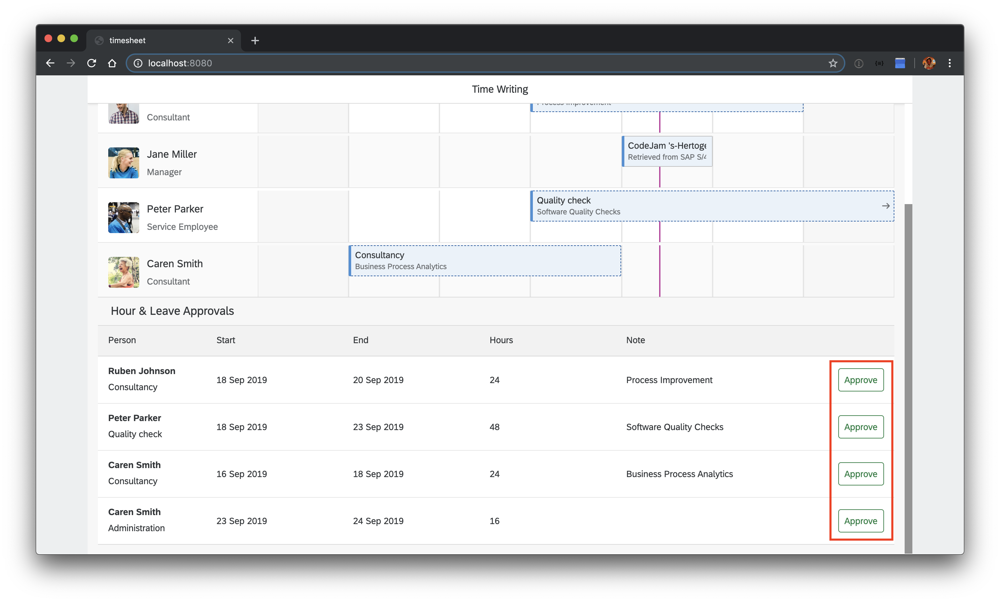
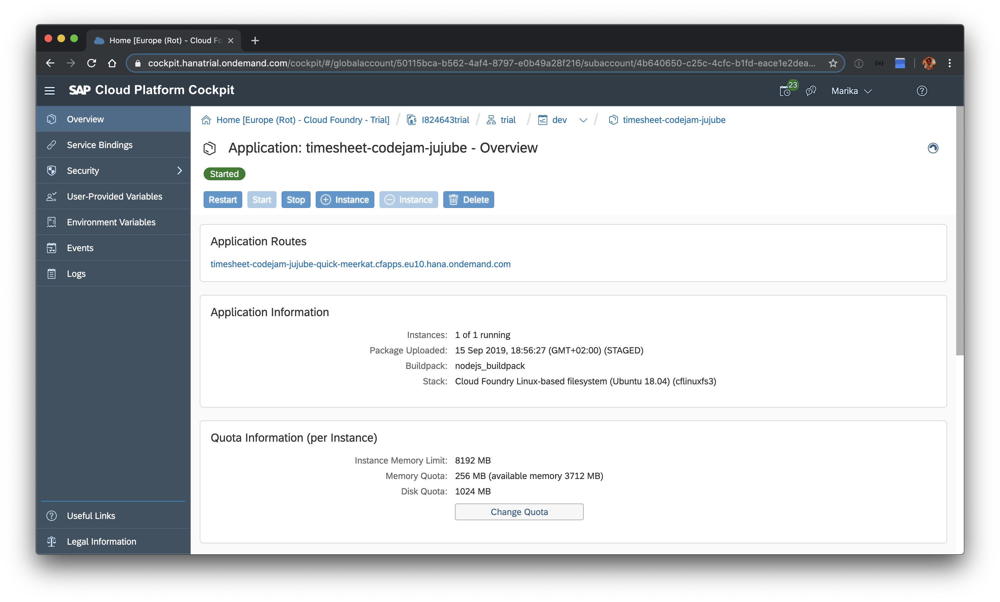
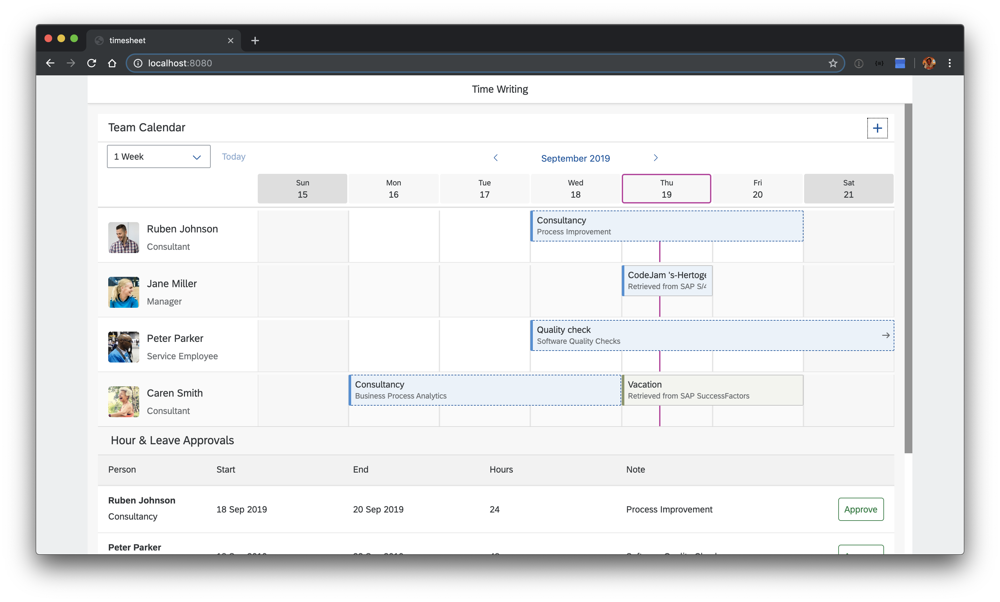

# SAP Cloud SDK Team Calendar
Learn how to build a side-by-side extension to SAP S/4HANA and SAP SuccessFactors using the SAP Cloud SDK for Javascript.

Start implementation using this sample and follow the given instructions.

You will learn how to:
  * setup and use some of the most common services on CloudFoundry
  * create read requests using the SAP Cloud SDK for Javascript
  * create create requests using the SAP Cloud SDK for Javascript
  * generate your own odata client for a service
  * use your previously generated odata client
  * deploy your application locally and on CloudFoundry
  * automate your application deployment

# Prerequisites

* Setup a [free trial](https://cloudplatform.sap.com/try.html) account for SAP Cloud Platform
* [Install Node.js and npm](https://docs.npmjs.com/downloading-and-installing-node-js-and-npm)
* [Install git](https://git-scm.com/book/en/v2/Getting-Started-Installing-Git)
  * When working on Windows make sure you have the Git Bash installed and configured to be used with npm (`npm config script-shell <P:\ath\to\your\bash.exe>`)
* [Install Visual Studio Code](https://code.visualstudio.com/download) or your favorite IDE for TypeScript
* [Install the Cloud Foundry CLI](https://docs.cloudfoundry.org/cf-cli/install-go-cli.html)

# Getting started
## Clone repository
First, clone this repository

## Start the application locally
Let's check that everything works and run the application locally. First, install the dependencies:

```sh
npm install
```

Deploy a local database (locally we use sqlite):
```sh
npm run cds-deploy
```

And start the application in watch mode, so that every change you implement subsequently is reflected immediately:
```sh
npm run watch:local
```

Now, you should find your application running at http://localhost:8080.


# Create a read request to SAP S/4HANA

## Implement the read request
Find the *TODO* in the `readS4AppointmentsByPerson` function in [src/read-appointments.ts](src/read-appointments.ts). Instead of returning an empty array implement a request to retrieve time sheet entries from SAP S/4HANA. You can try to implement this on your own using the following hints or peek at the [solution](SOLUTION.md#implement-the-read-request) and copy the implementation.

Use the `TimeSheetEntry.requestBuilder()` to create a request to get all TimeSheetEntries. Create the request by using the predefined variables and the following filters:

* `TimeSheetEntry.PERSON_WORK_AGREEMENT_EXTERNAL_ID` should equal `personId`
* `TimeSheetEntry.TIME_SHEET_DATE` should be greater or equal to `from`
* `TimeSheetEntry.TIME_SHEET_DATE` should be less or equal to `to`

Execute this request against the destination with the `destinationName` *S4HANA*.

Reload your application in the browser and check, whether there are new appoinments. You should see one for today's CodeJam:


> ### Where is the data coming from?
> Take a look at the [.env](.env) file. It is used to set the *destinations* environment variable, that provides technical information on remote systems we want to connect to (SAP S/4HANA and SAP SuccessFactors in our case).
> One of the destinations described here, has the name *S4HANA*. By executing your request and passing a `destinationName` you are implicitly using the technical information from the environment variable.

# Create a write request to SAP S/4HANA

## Build a TimeSheetEntry
Find the *TODO* in the `buildTimeSheetEntry` function in [src/write-appointments.ts](src/write-appointments.ts). Instead of returning `null` create a `TimeSheetEntry`. You can try to implement this on your own using the following hints or peek at the [solution](SOLUTION.md#build-a-timesheetentry) and copy the implementation.

Use the `TimeSheetEntry.builder()` to build a `TimeSheetEntry`. Set the following properties using the builders' fluent API:

* `personWorkAgreementExternalId` should be `externalId`
* `timeSheetDataFields` should be `timeSheetDataFields`
* `companyCode` should be `companyCode`
* `timeSheetStatus` should be `status`
* `timeSheetDate` should be `day`
* `timeSheetIsReleasedOnSave` should be `isReleasedOnSave`
* `timeSheetIsExecutedInTestRun` should be * `isExecutedInTestRun`
* `timeSheetOperation` should be `operation`

In the end build the entity using `.build()`.

## Write a TimeSheetEntry
Find the *TODO* in the `writeTimeSheetEntry` function in [src/write-appointments.ts](src/write-appointments.ts). Instead of just returning the `TimeSheetEntry` that was passed to the function, implement a request to create this entity in SAP S/4HANA.

You can try to implement this on your own using the following hints or or peek at the [solution](SOLUTION.md#write-a-timesheetentry) and copy the implementation.

Use the `TimeSheetEntry.requestBuilder()` to implement a request to create a `TimeSheetEntry`. Pass the given entry.

Execute this request against the destination with the `destinationName` *S4HANA*.

Refresh your application in the browser and try to approve a request. This request should now be written to SAP S/4HANA.


# Deploy your application to Cloud Foundry
Now, that you made some progress locally, let's make this application available in the cloud.

## Login to Cloud Foundry
You can login to Cloud Foundry using the following command on the command line:

```sh
cf login -a https://api.cf.eu10.hana.ondemand.com
```

Enter your credentials and choose an organization and space if necessary.

## Create service instances
We will need the following services for deployment to Cloud Foundry. Set them up as described in the following.

### HDI Container
In this application we are storing / reading data from SAP S/4HANA, SAP SuccessFactors and a local database. Create an HDI container to store local data in. Don't forget to replace the participantId:
```sh
cf create-service hanatrial hdi-shared timesheet-hdi-container-codejam-<participantId>
```

### XSUAA
Take a look at the `xs-security.json` file. It contains some configuration for the XSUAA service. The `tenant-mode` indicates that we want to share the OAuth client secret for all subaccounts that subscribe to this service instance, allowing for multi-tenancy. The `xsappname` must be unique throughout all spaces. **Therefore, replace the `<participantId>` with your participantId.**
For more information take a look [here](https://help.sap.com/viewer/4505d0bdaf4948449b7f7379d24d0f0d/2.0.03/en-US/3bfb120045694e21bfadb1344a693d1f.html).

Run the following to create an xsuaa service instance:
```sh
cf create-service xsuaa application my-xsuaa -c xs-security.json
```

### Destination
The [SAP Cloud Platform destination service](https://help.sap.com/viewer/cca91383641e40ffbe03bdc78f00f681/Cloud/en-US/34010ace6ac84574a4ad02f5055d3597.html) serves technical information on remote services or systems. Create an instance of this service:
```sh
cf create-service destination lite my-destination
```

This is what the service instances look like in the SAP Cloud Platform cockpit:


## Adjust the manifest.yml file
Let's adjust the [manifest.yml](manifest.yml), the configuration file for your CloudFoundry application.
Take a look at the services section, where we reference the previously created services instances.
Replace all occurences of `<participantId>` in the manifest.yml file.

## Build and push your application
Run the following to build and package your application:
```sh
npm run ci-build && npm run ci-package
```

Then push it to CloudFoundry:
```sh
cf push
```
As this will take a moment, proceed to the next step in the mean time.

## Configure Destinations on SAP Cloud Platform
Login to the [SAP Cloud Platform cockpit](https://cockpit.hanatrial.ondemand.com/cockpit/#/home/trialhome) and find your subaccount. Check the *Connectivity* tab on the left. Here you will find your configuration for connectivity services: **destinations** and **cloud connectors**.
You will need to [configure a cloud connector](https://help.sap.com/viewer/cca91383641e40ffbe03bdc78f00f681/Cloud/en-US/e6c7616abb5710148cfcf3e75d96d596.html) when you want to connect to an on premise system. Today, we will connect to a mocked cloud system and will therefore skip this step.

As we will retrieve data from SAP S/4HANA and SAP SuccessFactors, we have to configure those systems as destinations.
Click on the destinations and add two new destinations:

SAP S/4HANA destination:
> ```
> Name: S4HANA
> Type: HTTP
> URL: https://codejam-s4-mock-server.cfapps.eu10.hana.ondemand.com/
> Proxy type: Internet
> Authentication: NoAuthentication
>```

SAP SuccessFactors destination:
> ```
> Name: SFSF
> Type: HTTP
> URL: https://codejam-sfsf-mock-server.cfapps.eu10.hana.ondemand.com/
> Proxy type: Internet
> Authentication: NoAuthentication
>```


## Find your application running on SAP Cloud Platform
In the SAP Cloud Platform cockpit, go to the *Spaces* tab on the left and select the space that you logged in to on the command line before. Select your application *timesheet-codejam-\<participantId>* and click on the application route to see the application running.

Congratulations, you deployed an extension to SAP S/4HANA to the SAP Cloud Platform!


# Generate your own OData client
There are many scenarios where you have either your own OData service or want to integrate with another SAP OData service, that is not part of the SAP S/4HANA services, like SAP SucessFactors. For those cases you can generate your own OData client as described in the following.

## Download EDMX file
Download the service specification file for the [Employee Central Time Off service](https://api.sap.com/api/ECTimeOff/overview) from the SAP Business API Hub and put it into the [generator-input directory](generator-input/).

In this directory you will also find the [service mapping file](generator-input/service-mapping.json), that contains some extra configuration for the generated service(s), like the directory name and service path for the service.

## Run the generation
In your [package.json](package.json) you have already installed the `@sap/cloud-sdk-generator` dependency. Let's use it to run the generation. Pass the [generator-config.json](generator-config.json), where we specify input and output directories along with some other options for the generation.
```sh
npx generate-odata-client -c generator-config.json
```
Once this is completed you should find some generated code, your OData client, in the [src/generated/ec-time-off-service directory](src/generated/ec-time-off-service). We will use this code to request additional appointments from SAP SuccessFactors.

# Create a request with your own OData client

Find the *TODO* in the `readSfsfAppointmentsByPerson` function in [src/read-appointments.ts](src/read-appointments.ts). Instead of returning an empty array implement a request to retrieve employee time from SAP SucessFactors. You can try to implement this on your own using the following hints or peek at the [solution](SOLUTION.md#create-a-request-with-you-own-odata-client) and copy the implementation.

Use the `EmployeeTime.requestBuilder()` to create a request to get all EmployeeTime. Create the request by using the predefined variables.

**Select** the following properties:
* EmployeeTime.EXTERNAL_CODE,
* EmployeeTime.START_TIME,
* EmployeeTime.START_DATE,
* EmployeeTime.END_TIME,
* EmployeeTime.END_DATE,
* EmployeeTime.APPROVAL_STATUS,
* EmployeeTime.USER_ID

Add the following **filters**:

* `EmployeeTime.TIME_TYPE` should equal `timeType`
* `EmployeeTime.USER_ID` should equal `personId`
* `EmployeeTime.START_DATE` should be greator or equal to `from`
* `EmployeeTime.END_DATE` should be less or equal to `to`

This time, execute this request against the destination with the `destinationName` *SFSF*.

Reload your application in the browser and check, whether there are new appointments, especially vacations.



<!-- # Automate your deployment
TODO: -->
