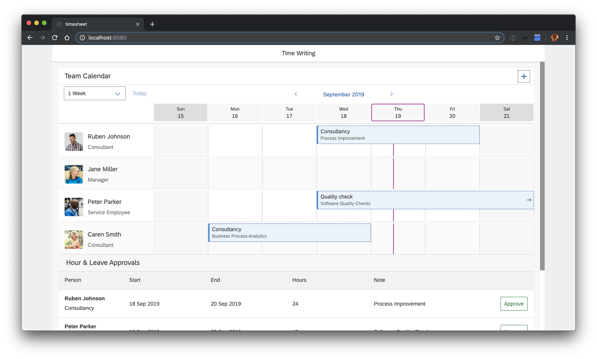

# Getting started
## Clone repository
First, clone this repository.

## Start the application locally
Let's check that everything works and run the application locally. First, install the dependencies:

```sh
npm install
```

Deploy a local database (locally we use sqlite):
```sh
npm run cds-deploy
```

And start the application in watch mode, so that every change you implement subsequently is reflected immediately:
```sh
npm run watch:local
```

Now, you should find your application running at http://localhost:8080.


