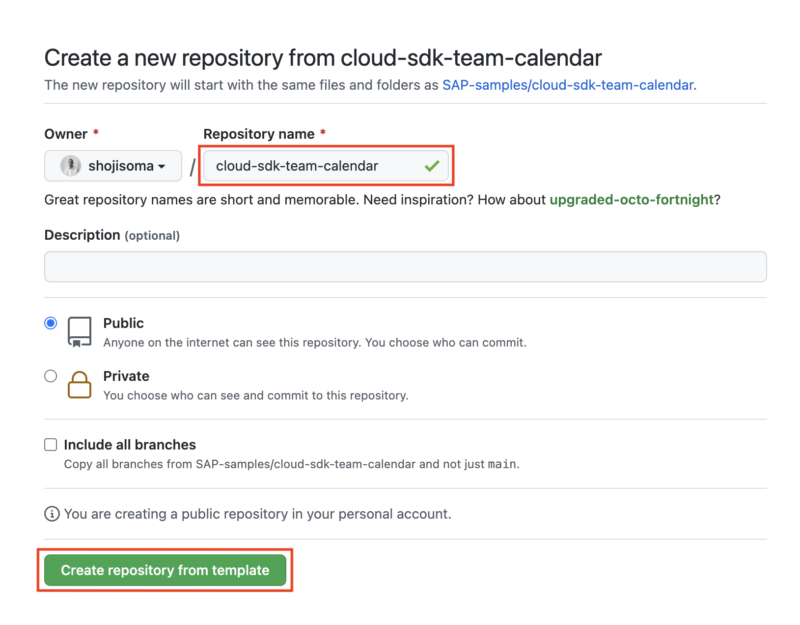

# Getting started
In the following we describe two ways to start working with the repository.
If you would like to automate your deployment in the end of this session, you will have to go through the longer process of [duplicating the repository](#fork-duplicate-repository).

If you are not planning on committing anything back to GitHub, you can just [clone this repository](#clone-repository) and skip the forking.

## Clone repository
Simply run
```sh
git clone https://github.com/SAP-samples/cloud-sdk-team-calendar.git
```
<!-- ```sh
git clone -b cloud-sdk-team-calendar --single-branch https://github.com/SAP/cloud-s4-sdk-book.git cloud-sdk-team-calendar
``` -->

## Fork / Duplicate repository
We recommend to duplicate this repository as a private repository as opposed to forking it as a public repository due to licensing constraints. In [exercise 5](05-generate-odata-client.md) we will generate an OData client for SAP SuccessFactors, that is subject to SAP Intellectual Property and should not be made available as Open Source. As long as you don't publish your changes, you can also just fork the repository.

### Create a private repository
For private duplication of a repository, first create a private repository on GitHub.
Open the form for creation of a new repository, by clicking *New*:


Fill in the name of your new repository (e. g. *cloud-sdk-team-calendar*) and check the **Private** radio button. Click on *Create repository*.


### Bare clone the original repository
On your command line run:
```sh
git clone --bare -b master --single-branch https://github.com/SAP-samples/cloud-sdk-team-calendar.git
```

<!-- ```sh
git clone --bare -b cloud-sdk-team-calendar --single-branch https://github.com/SAP/cloud-s4-sdk-book.git cloud-sdk-team-calendar.git
``` -->
This will clone the original repository to a *cloud-sdk-team-calendar.git* directory. Enter the directory:

```sh
cd cloud-sdk-team-calendar.git
```

### Mirror bare clone to your private repository
Mirror this bare repository to your previously created private repository. Don't forget to replace your GitHub username (and repository name if you chose a different one):
```sh
git push --mirror https://github.com/<your-github-username>/cloud-sdk-team-calendar.git
```

Now, you can delete the original clone:
```sh
cd ..
rm -rf cloud-sdk-team-calendar.git
```

### Clone your own repository
```sh
git clone https://github.com/<your-github-username>/cloud-sdk-team-calendar.git
```

## Start the application locally
Enter your project directory:
```sh
cd cloud-sdk-team-calendar
```

Let's check that everything works and run the application locally. First, install the dependencies:

```sh
npm install
```

Deploy a local database (locally we use sqlite):
```sh
npm run cds-deploy
```

And start the application in watch mode, so that every change you implement subsequently is reflected immediately:
```sh
npm run watch:local
```

Now, you should find your application running at http://localhost:8080.


