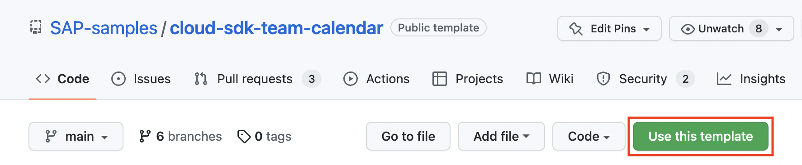
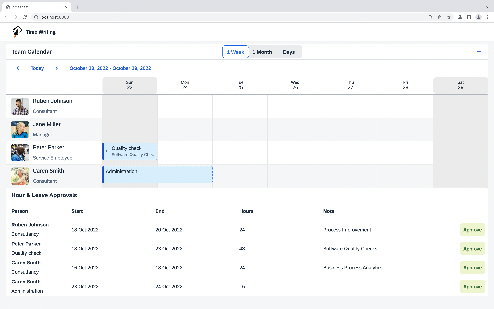

# Getting started

You will create a new repository based on this repository and run the application locally to get familiar with it.

## Create a new repository based on this template

Click the **Use this template** on the top of the GitHub page.


Fill in the name of your new repository (e. g. _cloud-sdk-team-calendar_). Click **Create repository**.


## Clone your repository

On your laptop open a command line and enter the following command. Don't forget to replace your username (and repository name should you have chosen a different one):

```sh
git clone https://github.com/YOUR_GITHUB_USERNAME/cloud-sdk-team-calendar.git
```

## Deploy the SAP S/4HANA and SAP SuccessFactors mock server (Optional)

Note: If you have access to real SAP S/4HANA Cloud and SAP SuccessFactors Cloud systems, you may be able to skip this step.

Follow these [instructions](https://github.com/SAP/cloud-s4-sdk-book/tree/mock-server#how-to-run-the-server) on how to set up your SAP S/4HANA and SAP SuccessFactors mock server and deploy it on the SAP Business Technology Platform (SAP BTP), Cloud Foundry environment.

## Setup the destinations environment variable

Replace the URL placeholders for the `S4HANA` and `SFSF` destinations in the [`.env`](../.env) file with the URL(s) of your mock server or your SAP S/4HANA and SAP SuccessFactors systems.

Since the mock server acts as both a mocked SAP S4/HANA system and SAP SuccessFactors system, the URL(s) for both destinations are the same.
Mock servers do not require authentication. If you are using the mock server, set the authentication type to `NoAuthentication`.

### How to find your mock server's URL

Open the [SAP BTP Cockpit](https://account.hana.ondemand.com) and open the subaccount to which the mockserver was deployed. Open the space, where the mock server was deployed. You should find the URL to the mock server here.

## Start the application locally

Open the project in your IDE. For the remainder of this tutorial, we will assume you are using Visual Studio Code. Please adapt accordingly if you are using a different IDE.

To open the project, go to **File > Open Folder...** and select the folder you just cloned from GitHub.

Let's check that everything works and run the application locally. First, open the command line with **Terminal > New Terminal**. Then, install the dependencies:

```sh
npm install
```

Deploy a local database with these steps:

1. create a local database with SQLite
2. drop existing tables and views, and re-create them according to [your CDS model](../db/data-model.cds)
3. deploy CSV files with initial data

In your [`package.json`](../package.json), you have already installed `@sap/cds-dk` (SAP Cloud Application Programming Model). The application programming model provides a command to do the 3 steps at once. deploy a local database with the command:

```sh
npm run cds-deploy
```

Start the local database with a [custom logic](../src/team-calendar-service.ts) that we defined for the table. The application programming model also provides a command for this step. start the local database with the command:

```sh
npm run cds-watch
```

And start the application in watch mode, so that every change you implement subsequently is reflected immediately:

```sh
npm run watch:local
```

Now, you should find your application running at http://localhost:8080.



## Next step: [Generate your own OData clients](02-generate-odata-clients.md)
