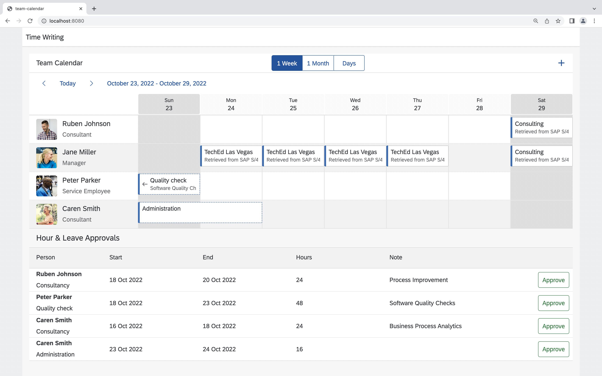

# Create a read request to SAP S/4HANA
Let's write some code! The application is supposed to show appointments from three different sources, one of those being SAP S/4HANA. Implement the data retrieval as described in the following.

## Implement the read request
Find the *TODO* in the `readS4AppointmentsByPerson` function in [src/read-appointments.ts](src/read-appointments.ts). Instead of returning an empty array, implement a request to retrieve time sheet entries from SAP S/4HANA. You can try to implement this on your own using the following hints or peek at the [solution](SOLUTION.md#implement-the-read-request) and copy the implementation.

Use the `TimeSheetEntry.requestBuilder()` to create a request to get all TimeSheetEntries. Create the request by using the predefined variables and the following filters:

* `TimeSheetEntry.PERSON_WORK_AGREEMENT_EXTERNAL_ID` should equal `personId`
* `TimeSheetEntry.TIME_SHEET_DATE` should be greater or equal to `from`
* `TimeSheetEntry.TIME_SHEET_DATE` should be less or equal to `to`

Execute this request against the destination with the `destinationName` *S4HANA*.

Reload your application in the browser and check, whether there are new appoinments. You should see one for today's CodeJam:

> ### Where is the data coming from?
> Take a look at the [.env](.env) file. It is used to set the *destinations* environment variable, that provides technical information on remote systems we want to connect to (SAP S/4HANA and SAP SuccessFactors in our case).
> One of the destinations described here, has the name *S4HANA*. By executing your request and passing a `destinationName` you are implicitly using the technical information from the environment variable.
