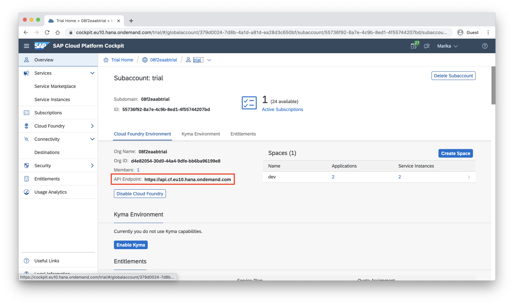
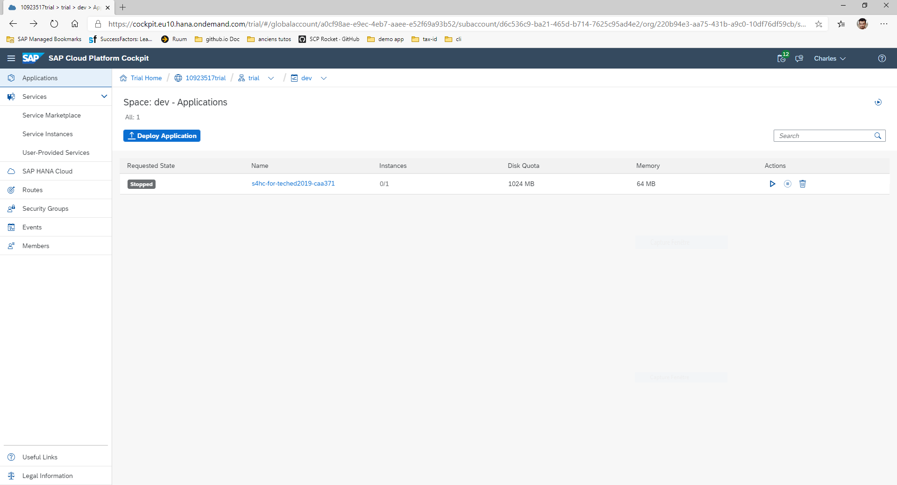

# Create a read request to SAP S/4HANA
Let's write some code! The application is supposed to show appointments from three different sources, one of those being SAP S/4HANA. Implement the data retrieval as described in the following.

## Deploy the S/4HANA mock server (Optional)

Note: If you have access to an SAP S/4HANA Cloud system, you can skip this step.

Download the [SAP S/4HANA mock server](https://github.com/SAP/cloud-s4-sdk-book/tree/mock-server) in a new folder.

You need to add the two `EDMX` files [time-off](https://api.sap.com/api/API_MANAGE_WORKFORCE_TIMESHEET/overview) and [timesheet](https://api.sap.com/api/ECTimeOff/overview): Go to Details, then Download API Specification and choose EDMX.

Put these files in folders `time-off` and `timeSheetEntryCollection` respectively.

Generate the services by running these commands in the command line:
```sh
npm run generate-test-resources:calendar
npm run generate-test-resources:time-off
```

Open the SAP [Cloud Platform Cockpit](https://account.hana.ondemand.com/) and navigate to the subaccount you are planning to deploy your application to. Click on “Overview” on the left and you can see the URL of the API endpoint.



Copy the URL and paste it into the following command in your command line:
```sh
cf login -a https://api.cf.<region>.hana.ondemand.com
```

Enter your credentials and choose an organization and space if necessary.

Push the mock server to Cloud Foundry:
```sh
cf push
```

Open the SAP [Cloud Platform Cockpit](https://account.hana.ondemand.com/) and open your subaccount, if you have a trial account it should be called trial, then open your space, where your applications are deployed, you should find the newly deployed mock server.



Open it and copy the route, you can then replace the S4HANA `url` in the [`.env`](../.env) file with the route url of the server.

## Implement the read request
Find the *TODO* in the `readS4AppointmentsByPerson` function in [src/read-appointments.ts](../src/read-appointments.ts). Instead of returning an empty array, implement a request to retrieve time sheet entries from SAP S/4HANA. You can try to implement this on your own using the following hints or peek at the [solution](SOLUTION.md#implement-the-read-request) and copy the implementation.

Use the `TimeSheetEntry.requestBuilder()` to create a request to get all TimeSheetEntries. Create the request by using the predefined variables and the following filters:

* `TimeSheetEntry.PERSON_WORK_AGREEMENT_EXTERNAL_ID` should equal `personId`
* `TimeSheetEntry.TIME_SHEET_DATE` should be greater or equal to `from`
* `TimeSheetEntry.TIME_SHEET_DATE` should be less or equal to `to`

Execute this request against the destination with the `destinationName` *S4HANA*.

Reload your application in the browser and check, whether there are new appoinments. You should see one for today's CodeJam:


> ### Where is the data coming from?
> Take a look at the [.env](../.env) file. It is used to set the *destinations* environment variable, that provides technical information on remote systems we want to connect to (SAP S/4HANA and SAP SuccessFactors in our case).
> One of the destinations described here, has the name *S4HANA*. By executing your request and passing a `destinationName` you are implicitly using the technical information from the environment variable.
