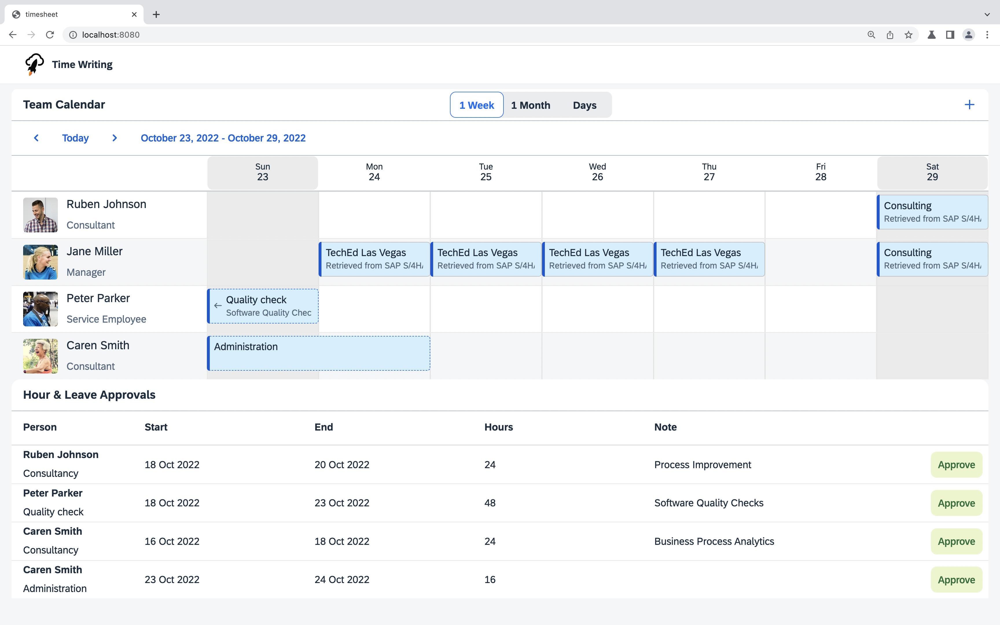

# Create a read request to SAP S/4HANA

Let's write some code! The application is supposed to show appointments from three different sources, one of those being SAP S/4HANA. Implement the data retrieval as described in the following.

## Implement the read request

Find the _TODO_ in the `readS4AppointmentsByPerson` function in [`src/read-appointments.ts`](../src/read-appointments.ts). Instead of returning an empty array, implement a request to retrieve timesheet entries from SAP S/4HANA. You can try to implement this on your own using the following hints or peek at the [solution](SOLUTION.md#implement-the-read-request-to-sap-s4hana) and copy the implementation.

Use the `timeSheetEntryApi.requestBuilder()` to create a request to get all TimeSheetEntries. Create the request by using the predefined variables and the following filters:

- `timeSheetEntryApi.schema..PERSON_WORK_AGREEMENT_EXTERNAL_ID` should equal `personId`
- `timeSheetEntryApi.schema..TIME_SHEET_DATE` should be greater or equal to `from`
- `timeSheetEntryApi.schema..TIME_SHEET_DATE` should be less or equal to `to`

Execute this request against the destination by setting the `destinationName` to `S4HANA`.

Reload your application in the browser and check, whether there are new appointments.

### Where is the data coming from?

Go back to the [`.env`](../.env) file. It is used to set the `destinations` environment variable, that provides technical information on remote systems we want to connect to (SAP S/4HANA and SAP SuccessFactors in our case).

One of the destinations described here, has the name `S4HANA`. By executing your request and passing a `destinationName` you are implicitly using the technical information from the environment variable. If you want to find out more about the destination concept have a look at our [documentation](https://sap.github.io/cloud-sdk/docs/js/features/connectivity/destination#referencing-destinations-by-name).

## Next step: [Create a write request to SAP S/4HANA](04-s4-write-request.md)
