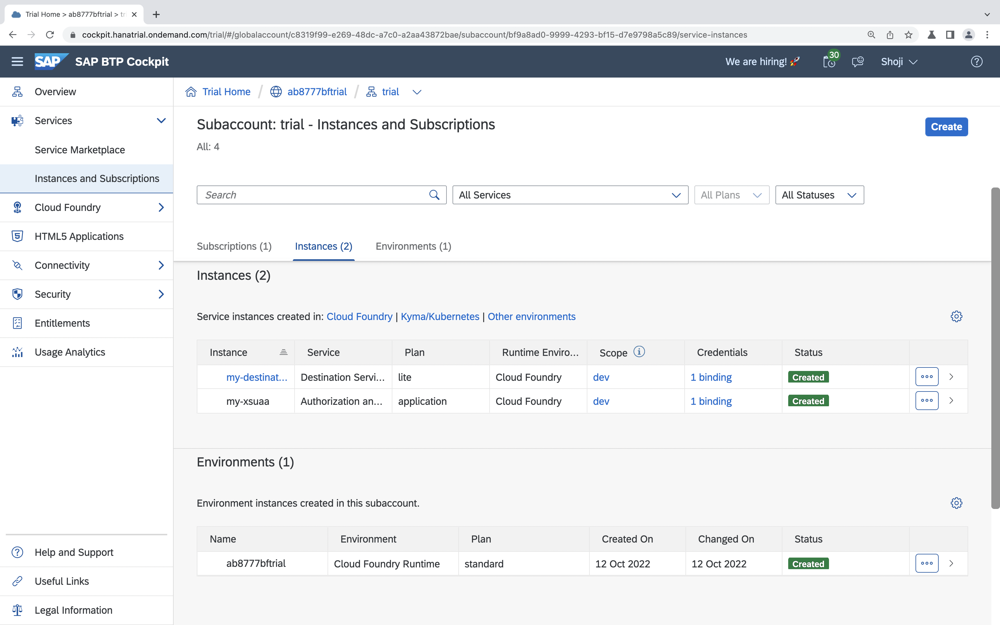
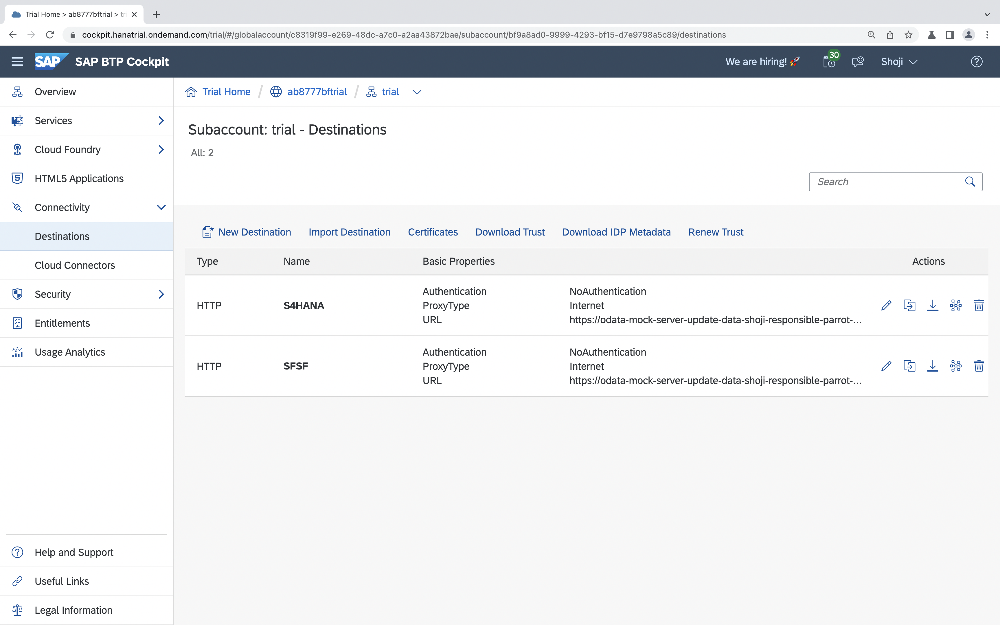

# Deploy your application to Cloud Foundry
Now, that you made some progress locally, let's make this application available in the cloud.

## Login to Cloud Foundry
You can login to Cloud Foundry using the following command on the command line:

```sh
cf login -a https://api.cf.eu10.hana.ondemand.com
```

Enter your credentials and choose an organization and space if necessary.

## Create service instances
We will need some services for deployment to Cloud Foundry. We will need an HDI container to store local data, a service for Authorization and Trust Management (XSUAA) and a destination service. Set them up as described in the following.

### HDI Container
In this application we are storing / reading data from SAP S/4HANA, SAP SuccessFactors and a local database. Create an HDI container to store local data in. Don't forget to replace the participantId:
```sh
cf create-service hanatrial hdi-shared timesheet-hdi-container-codejam-<participantId>
```

### Authorization and Trust Management
Take a look at the `xs-security.json` file. It contains some configuration for the XSUAA service. The `tenant-mode` indicates that we want to share the OAuth client secret for all subaccounts that subscribe to this service instance, allowing for multi-tenancy. The `xsappname` must be unique throughout all spaces. **Therefore, replace the `<participantId>` with your participantId.**
For more information take a look [here](https://help.sap.com/viewer/4505d0bdaf4948449b7f7379d24d0f0d/2.0.03/en-US/3bfb120045694e21bfadb1344a693d1f.html).

Run the following to create an xsuaa service instance:
```sh
cf create-service xsuaa application my-xsuaa -c xs-security.json
```

### Destination
The [SAP Cloud Platform destination service](https://help.sap.com/viewer/cca91383641e40ffbe03bdc78f00f681/Cloud/en-US/34010ace6ac84574a4ad02f5055d3597.html) serves technical information on remote services or systems. Create an instance of this service:
```sh
cf create-service destination lite my-destination
```

This is what the service instances should look like in the SAP Cloud Platform cockpit:


## Adjust the manifest.yml file
Let's adjust the [manifest.yml](manifest.yml), the configuration file for your Cloud Foundry application.
Take a look at the services section, where we reference the previously created services instances.
Replace all occurences of `<participantId>` in the manifest.yml file.

## Build and push your application
Run the following to build and package your application:
```sh
npm run ci-build && npm run ci-package
```

Then push it to Cloud Foundry:
```sh
cf push
```
As this will take a moment, proceed to the next step in the mean time.

## Configure Destinations on SAP Cloud Platform
Login to the [SAP Cloud Platform cockpit](https://cockpit.hanatrial.ondemand.com/cockpit/#/home/trialhome) and find your subaccount. Check the *Connectivity* tab on the left. Here you will find your configuration for connectivity services: **destinations** and **cloud connectors**.
You will need to [configure a cloud connector](https://help.sap.com/viewer/cca91383641e40ffbe03bdc78f00f681/Cloud/en-US/e6c7616abb5710148cfcf3e75d96d596.html) when you want to connect to an on premise system. Today, we will connect to a mocked cloud system and will therefore skip this step.

As we will retrieve data from SAP S/4HANA and SAP SuccessFactors, we have to configure those systems as destinations.
Click on the destinations and add two new destinations:

SAP S/4HANA destination:
> ```
> Name: S4HANA
> Type: HTTP
> URL: https://codejam-s4-mock-server.cfapps.eu10.hana.ondemand.com/
> Proxy type: Internet
> Authentication: NoAuthentication
>```

SAP SuccessFactors destination:
> ```
> Name: SFSF
> Type: HTTP
> URL: https://codejam-sfsf-mock-server.cfapps.eu10.hana.ondemand.com/
> Proxy type: Internet
> Authentication: NoAuthentication
>```

This is what the configured destinations should look like in the SAP Cloud Platform cockpit:



## Find your application running on SAP Cloud Platform
In the SAP Cloud Platform cockpit, go to the *Spaces* tab on the left and select the space that you logged in to on the command line before. Select your application *timesheet-codejam-\<participantId>* and click on the application route to see the application running.


**Congratulations**, you deployed an extension to SAP S/4HANA to the SAP Cloud Platform!

