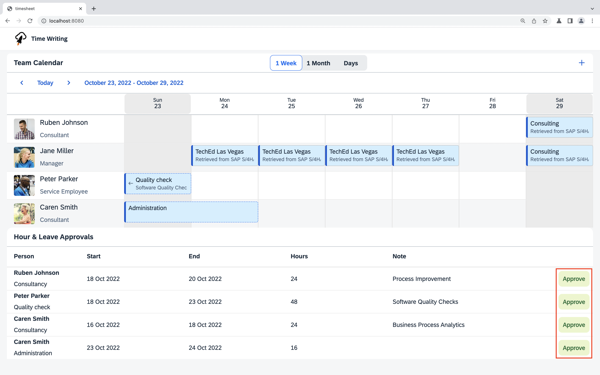

# Create a write request to SAP S/4HANA

Approving locally stored appointments shall create an appointment in SAP S/4HANA. Let's write back to SAP S/4HANA. For that, we need to create an entity to be written and then actually write it.

## Build a TimeSheetEntry

Find the _TODO_ in the `buildTimeSheetEntry` function in [`src/write-appointments.ts`](../src/write-appointments.ts). Instead of returning `null` create a `TimeSheetEntry`. You can try to implement this on your own using the following hints or peek at the [solution](SOLUTION.md#build-a-timesheetentry) and copy the implementation.

Use the `timeSheetEntryApi.entityBuilder()` to build a `TimeSheetEntry`. Set the following properties using the builders' fluent API:

- `personWorkAgreementExternalId` should be `externalId`
- `timeSheetDataFields` should be `timeSheetDataFields`
- `companyCode` should be `companyCode`
- `timeSheetStatus` should be `status`
- `timeSheetDate` should be `day`
- `timeSheetIsReleasedOnSave` should be `isReleasedOnSave`
- `timeSheetIsExecutedInTestRun` should be \* `isExecutedInTestRun`
- `timeSheetOperation` should be `operation`

In the end, build the entity using `.build()`.

## Write a TimeSheetEntry

Find the _TODO_ in the `writeTimeSheetEntry` function in [`src/write-appointments.ts`](../src/write-appointments.ts). Instead of just returning the `TimeSheetEntry` that was passed to the function, implement a request to create this entity in SAP S/4HANA.

You can try to implement this on your own using the following hints or peek at the [solution](SOLUTION.md#write-a-timesheetentry) and copy the implementation.

Use the `timeSheetEntryApi.requestBuilder()` to implement a request to create a `TimeSheetEntry`. Pass the given entry.

Execute this request against the destination with a `destinationName` - `S4HANA`.

Refresh your application in the browser and try to approve a request. This request should now be written to SAP S/4HANA.

## Next step: [Create a read request to SAP SuccessFactors](05-sfsf-read-request.md)
