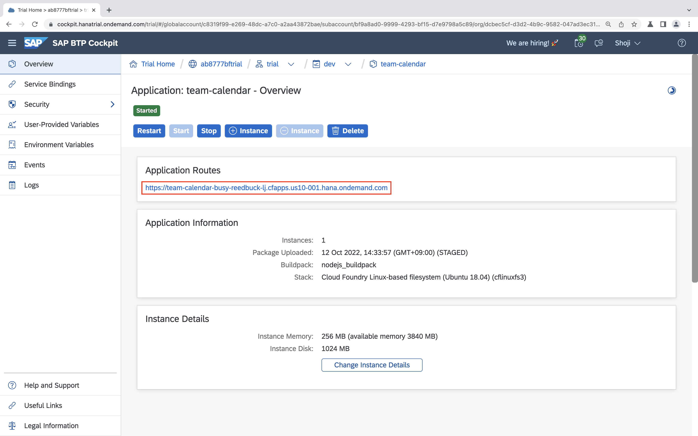

# Deploy your application to Cloud Foundry

Now, that you made some progress locally, let's make this application available in the cloud.

## Log in to Cloud Foundry

You need to log in to Cloud Foundry in SAP Business Technology Platform using the Cloud Foundry CLI. First, you need to set an API endpoint. The exact URL of this API endpoint depends on the region your **subaccount** is in. Open the [SAP Business Technology Platform Cockpit](https://account.hana.ondemand.com/) and navigate to the subaccount you are planning to deploy your application. Click on `Overview` on the left and you can see the URL of the API endpoint.


Copy the URL and paste it into the following command in your command line (if you haven't logged in before):

```sh
cf login -a https://api.cf.YOUR_REGION.hana.ondemand.com
```

Enter your credentials and choose an organization and space if necessary.

## Create service instances

We will need some services for deployment to Cloud Foundry. We will need a service for Authorization and Trust Management (XSUAA) and destination service. Set them up as described in the following.

### Authorization and Trust Management

Take a look at the `xs-security.json` file. It contains some configurations for the XSUAA service. The `tenant-mode` indicates that we want to share the OAuth client secret for all subaccounts that subscribe to this service instance, allowing for multi-tenancy. The `xsappname` must be unique throughout all spaces.

For more information take a look [here](https://help.sap.com/viewer/4505d0bdaf4948449b7f7379d24d0f0d/2.0.03/en-US/3bfb120045694e21bfadb1344a693d1f.html).

Run the following to create an xsuaa service instance:

```sh
cf create-service xsuaa application my-xsuaa -c xs-security.json
```

### Destination

The [SAP BTP destination service](https://help.sap.com/viewer/cca91383641e40ffbe03bdc78f00f681/Cloud/en-US/34010ace6ac84574a4ad02f5055d3597.html) serves technical information on remote services or systems. Create an instance of this service:

```sh
cf create-service destination lite my-destination
```

This is what the service instances should look like in the SAP BTP cockpit:


## Build and push your application

Run the following to build and package your application:

```sh
npm run ci-build && npm run ci-package
```

Eventually, push it to Cloud Foundry:

```sh
cf push
```

As this will take a moment, proceed to the next step in the meantime.

## Configure Destinations on SAP BTP

Login to the [SAP BTP cockpit](https://cockpit.hanatrial.ondemand.com/cockpit/#/home/trialhome) and find your subaccount. Check the `Connectivity` tab on the left. Here you will find your configuration for connectivity services: **destinations** and **cloud connectors**.
You will need to [configure a cloud connector](https://help.sap.com/viewer/cca91383641e40ffbe03bdc78f00f681/Cloud/en-US/e6c7616abb5710148cfcf3e75d96d596.html) when you want to connect to an on-premise system.

As we will retrieve data from SAP S/4HANA and SAP SuccessFactors, we have to configure those systems as destinations.
Click on the destinations and add two new destinations:

SAP S/4HANA destination:

```
Name: S4HANA
Type: HTTP
URL: S4_SERVER_URL
Proxy type: Internet
Authentication: S4_AUTHENTICATION_TYPE
```

SAP SuccessFactors destination:

```
Name: SFSF
Type: HTTP
URL: SFSF_SERVER_URL
Proxy type: Internet
Authentication: SFSF_AUTHENTICATION_TYPE
```

Refer [`.env`](../.env) file if you don't remember the `URL` and `Authentication` as you defined them in [exercise 1](01-getting-started.md#setup-the-destinations-environment-variable).

This is what the configured destinations should look like in the SAP BTP cockpit:


## Find your application running on SAP BTP

In the SAP BTP cockpit, go to the `Spaces` tab on the left and select the space that you logged into on the command line before. Select your application `team-calendar` and click on the application route to see the application running.



**Congratulations**, you deployed an extension to SAP S/4HANA to the SAP BTP!

## Next step: [Automate deployment](07-automate-deployment.md)
