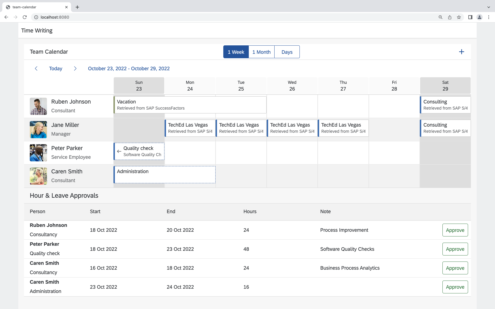

# Create a request with your own OData client

Find the *TODO* in the `readSfsfAppointmentsByPerson` function in [src/read-appointments.ts](src/read-appointments.ts). Instead of returning an empty array implement a request to retrieve employee time from SAP SucessFactors. You can try to implement this on your own using the following hints or peek at the [solution](SOLUTION.md#create-a-request-with-you-own-odata-client) and copy the implementation.

Use the `EmployeeTime.requestBuilder()` to create a request to get all EmployeeTime. Create the request by using the predefined variables.

**Select** the following properties:
* EmployeeTime.EXTERNAL_CODE,
* EmployeeTime.START_TIME,
* EmployeeTime.START_DATE,
* EmployeeTime.END_TIME,
* EmployeeTime.END_DATE,
* EmployeeTime.APPROVAL_STATUS,
* EmployeeTime.USER_ID

Add the following **filters**:

* `EmployeeTime.TIME_TYPE` should equal `timeType`
* `EmployeeTime.USER_ID` should equal `personId`
* `EmployeeTime.START_DATE` should be greator or equal to `from`
* `EmployeeTime.END_DATE` should be less or equal to `to`

This time, execute this request against the destination with the `destinationName` *SFSF*.

Reload your locally deployed application in the browser and check, whether there are new appointments, especially vacations.

<!-- # Automate your deployment
TODO: -->
