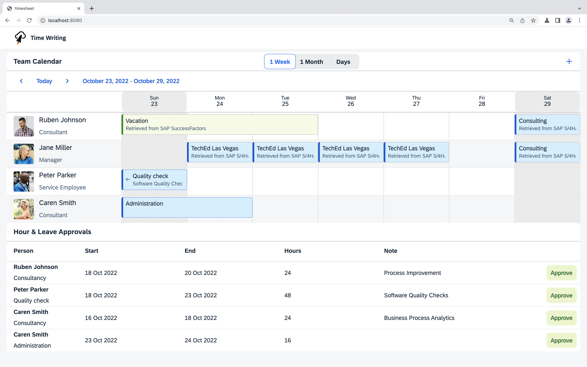

# Create a request with your own OData client

## Deploy the S/4HANA mock server (Optional)

Note: If you have access to an SAP Successfactors Cloud system, you can skip this step.

The [SAP SFSF mock server](https://github.com/SAP/cloud-s4-sdk-book/tree/mock-server) is the same mock server as the SAP S/4HANA mock server. Don't forget to replace the SFSF `url` in the [`.env`](../.env) file with the route url of the server.

## Implement the request
Find the *TODO* in the `readSfsfAppointmentsByPerson` function in [src/read-appointments.ts](../src/read-appointments.ts). Instead of returning an empty array implement a request to retrieve employee time from SAP SuccessFactors. You can try to implement this on your own using the following hints or peek at the [solution](SOLUTION.md#create-a-read-request-to-sap-s4hana) and copy the implementation.

Use the `EmployeeTime.requestBuilder()` to create a request to get all EmployeeTime. Create the request by using the predefined variables.

**Select** the following properties:
* EmployeeTime.EXTERNAL_CODE,
* EmployeeTime.START_TIME,
* EmployeeTime.START_DATE,
* EmployeeTime.END_TIME,
* EmployeeTime.END_DATE,
* EmployeeTime.APPROVAL_STATUS,
* EmployeeTime.USER_ID

Add the following **filters**:

* `EmployeeTime.TIME_TYPE` should equal `timeType`
* `EmployeeTime.USER_ID` should equal `personId`
* `EmployeeTime.START_DATE` should be greater or equal to `from`
* `EmployeeTime.END_DATE` should be less or equal to `to`

This time, execute this request against the destination with the `destinationName` *SFSF*.

Reload your locally deployed application in the browser and check, whether there are new appointments, especially vacations.

<!-- # Automate your deployment
TODO: -->
