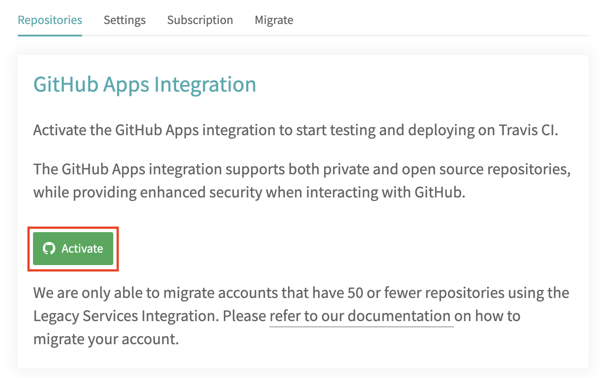
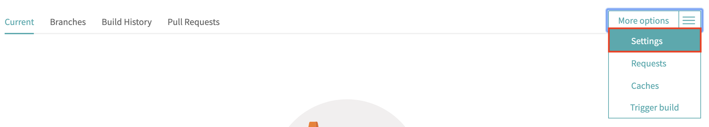
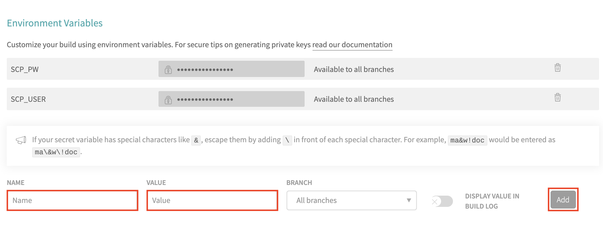
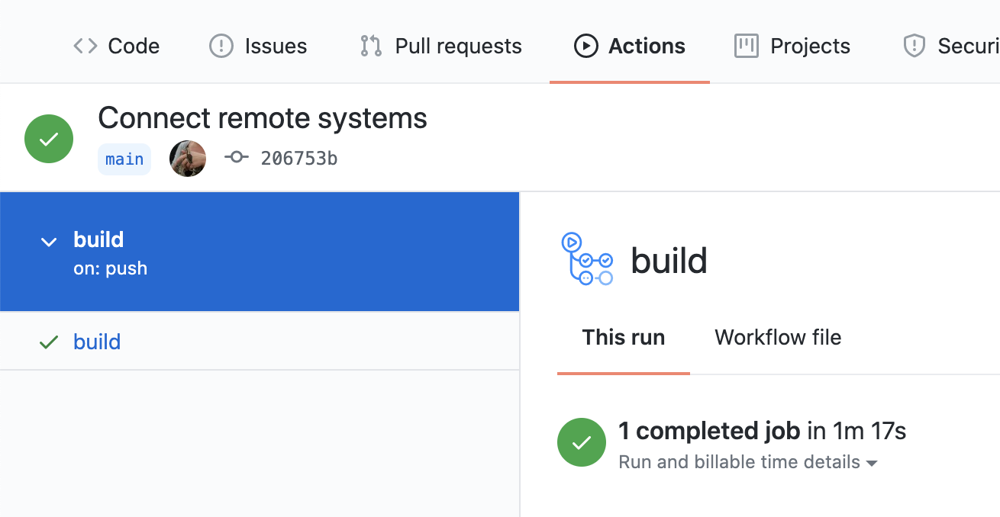

# Automate deployment
In a real world scenario you would only deploy your changes, once they have been tested for quality. You would execute the tests and checks as well as the deployment automatically. Therefore, we provide the [SAP Cloud SDK Continuous Delivery Toolkit](https://github.com/SAP/cloud-s4-sdk-pipeline) in addition to the libraries that you have seen before.

This toolkit allows you to easily setup and configure a continuuous delivery pipeline for Jenkins. It also supports Travis CI (less feature rich) and GitHub Actions (experimental).

Let's configure Travis CI as a lightweight solution today.

## Login to Travis CI
Go to https://travis-ci.com/ and login / signup with your GitHub account.
You might need to activate the GitHub apps integration:



Choose the repositories you want to activate this for (or just activate for all repositories):


## Set credentials for deployment
Now set your credentials in Travis CI. Go to the settings of your application:


Set two environment variables *SCP_USER* with your user name and *SCP_PW* with your password. Note that the *DISPLAY VALUE IN BUILD LOG* switch should be turned off, so that nobody can see your password or username. However, unfortunately, while entering your credentials they are visible. These variables will be used for the automatic deployment of your application.



## Review the CI / CD configuration
Let's take a look at some configuration files.
Those files are the main configuration files and will be needed if you run an actual Jenkins server productively:
* [JenkinsFile](JenkinsFile): All this file does is load a preconfigured Jenkins pipeline from GitHub.
* [pipeline_config.yml](pipeline_config.yml): Configure the steps and stages of your pipeline.

Those files are necessary to run the pipeline with Travis CI:
* [jenkins.yml](jenkins.yml): Jenkins configuration as code.
* [.travis.yml](.travis.yml): This is the Travis CI configuration file. It starts a docker container, where we run our JenkinsFile.

## Adjust pipeline configuration
Go to the [pipeline_config.yml](pipeline_config.yml) file and adjust it to your project. Set the org and space for the `productionDeployment` as you have done before when logging in to Cloud Foundry (if you don't remember run `cf target` on the command line to get a summary).
Also, replace your participantId for the `appName`.

## Publish your changes
Commit your changes by executing:
```sh
git commit -am "Connect remote systems"
```

Publish your commit:
```sh
git push
```

Go back to Travis CI and check whether your build has been started. This will take a few minutes.
You can take a look at the logs. If anything fails try to figure out what went wrong and fix it.



If all checks pass, reload your Cloud Foundry application. It should now contain vacation data, too.

**Congratulations!** You solved all exercises!
