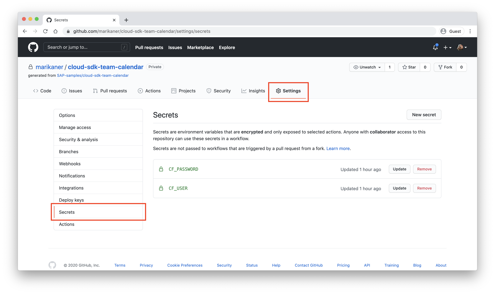

# Automate deployment
In a real world scenario you would only deploy your changes, once they have been tested for quality. You would execute the tests and checks as well as the deployment automatically. Therefore, we provide the [SAP Cloud SDK Continuous Delivery Toolkit](https://github.com/SAP/cloud-s4-sdk-pipeline) in addition to the libraries that you have seen before.

This toolkit allows you to easily setup and configure a continuuous delivery pipeline for Jenkins. It also supports Travis CI (less feature rich) and GitHub Actions (experimental).

We will use Github Actions as a lightweight solution today.

## Review the CI / CD configuration
Let's take a look at some configuration files:
* [pipeline_config.yml](../pipeline_config.yml): Configure the steps of your pipeline.
* [build.yml](../.github/workflows/build.yml): Arrange steps for your pipeline.

If you use the SAP Cloud SDK Continuous Delivery Toolkit in a productive environment you will probably rather use a Jenkins server as of today. For this you would load the pipeline through a Jenkins file and would not need to arrange your steps in the `build.yml`.

## Adjust pipeline configuration
Go to the [pipeline_config.yml](../pipeline_config.yml) file and adjust it to your project. Set the org and space for the `cloudFoundryDeploy` step as you have done before when logging in to Cloud Foundry (if you don't remember run `cf target` on the command line to get a summary).
Also, replace your participantId for the `appName`.

## Set credentials for deployment
Take a look at the `build.yml` file. The `Deploy` step will deploy your application to the SAP Cloud Platform. This step needs credentials.
To set your credentials in Github go to  "Settings" and then "Secrets":


Create two new secrets *CF_USER* with your user name and *CF_PASSWORD* with your password. Note that even though your credentials are visible while you are entering them, later on they will be hidden.

## Publish your changes
Stage all your changes in git:
```sh
git add .
```

Commit your changes by executing:
```sh
git commit -m "Connect remote systems"
```

Publish your commit:
```sh
git push
```

Go back to Travis CI and check whether your build has been started. This will take a few minutes.
You can take a look at the logs. If anything fails try to figure out what went wrong and fix it.


If all checks pass, reload your Cloud Foundry application. It should now contain vacation data, too.

**Congratulations!** You solved all exercises!
